# 🌠 Prostargram
개발에 관련된 일상을 공유하는 `SNS(Social Network Services)`입니다.

`Pro`grammer와 대표적인 SNS 플랫폼 In`stagram`에서 따와
`Prostargram`으로 작명했습니다.

※ 프로젝트에 대해 더 자세히 알고 싶으시다면 [Wiki](https://github.com/f-lab-edu/Prostargram/wiki)를 참고해주시길 바랍니다.

## 📚 Tech Stack
`Java 17`, `Spring boot`, `MySQL`, `RabbitMQ`, `Redis`, `Naver Cloud Platform`, `Grafana`, `Prometheus`

## ✏️ Period
구현 : `2023.07 ~ 2024.01`

리팩토링 : `2024.08` ~

## 🔖 Tech Topic
피드 시스템 설계를 주제로 F-lab 주최 미니 컨퍼런스에서 발표를 진행했습니다. 

[발표 영상 바로가기](https://www.youtube.com/watch?v=O_C9r5cduVE&t=348s)

# 💭 프로젝트를 진행하며 했던 고민들..
[1. 피드 조회 API 성능 최적화 (TPS 45 → TPS 849)](#1%EF%B8%8F⃣-피드-조회-api-성능-최적화-tps-45--tps-849)

[2. 댓글 조회 쿼리 성능 최적화 (1s 118ms -> 108ms)](#2%EF%B8%8F⃣-댓글-조회-쿼리-성능-최적화)

# 1️⃣ 피드 조회 API 성능 최적화 (TPS 45 → TPS 849)
## 요구사항
아래 홈 화면에서 피드를 조회할 수 있다.

본인이 팔로우하고 있는 유저가 작성한 게시물은 본인의 피드에 노출된다.

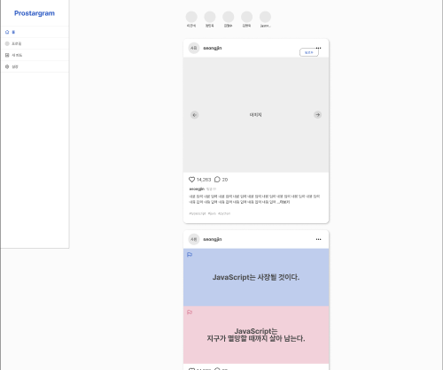

## 피드를 조회 병목 분석
```SQL
SELECT post_id
FROM POST
WHERE user_id IN ({followerIds})
ORDER BY post_id
WHERE post_id > {lastPostId}  # Cursor Pagination (No Offset)
LIMIT 10                      # PAGE_SIZE
```

본인의 피드가 어떤 게시물로 구성되어야 하는지를 조회하기위해 위 쿼리가 필요하다.

## 쿼리의 병목 지점
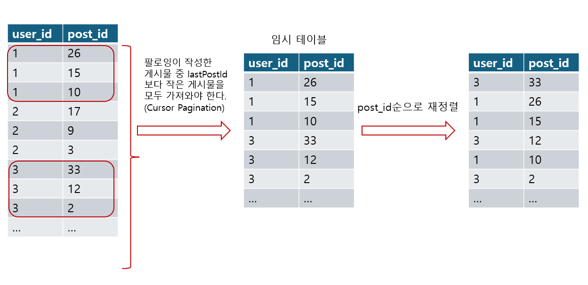

1. 팔로잉이 작성한 게시물을 읽어오기 위해 followingIds를 통해 IN절로 조회 필요 
2. 따라서, 팔로잉 수만큼의 인덱스 탐색이 필요 
3. 팔로잉이 작성한 모든 게시물을 임시테이블에 읽어와서 정렬 
<!-- 
## MySQL 의 IN절 개수 제한 이야기 -->

<!-- ## IN절 대신 JOIN을 사용하면 어떻게 될까?
JOIN을 이용하면 Nested Loop JOIN이 필요하며 이것 또한 성능이 낮아지는 병목이 된다는 것을 설명한다. -->

## 💡 게시물이 작성되는 시점에 피드를 구성하여 캐싱하기
RabbitMQ를 활용한 FanOut Server(Consumer) 코드는 이곳을 참조해주시길 바랍니다. ([링크](https://github.com/eunbileeme/Prostargram-Consumer))


유저가 게시물을 작성하면 해당 게시물이 누구의 피드에 노출되어야 하는지를 확인하여 뉴스피드에 캐싱한다.

뉴스피드 캐시는 key: user_id, values: post_ids로 구성된다.

1번 key에 [1,2,3,4,5] values가 저장되어 있다면 1번 유저의 피드에 1~5번 게시물이 노출되어야 함을 의미한다.

## 피드 조회 과정


## 성능 측정
쿼리를 통한 조회 성능에 비해 약 1900% 성능 개선 **(TPS 45 → TPS 849)**
- 더미 데이터: 전체 게시물 2억개, 팔로잉의 게시물 2만개
- 테스트 환경: i5-10400(6 core), 16GB RAM

## 피드 조회 시간 복잡도
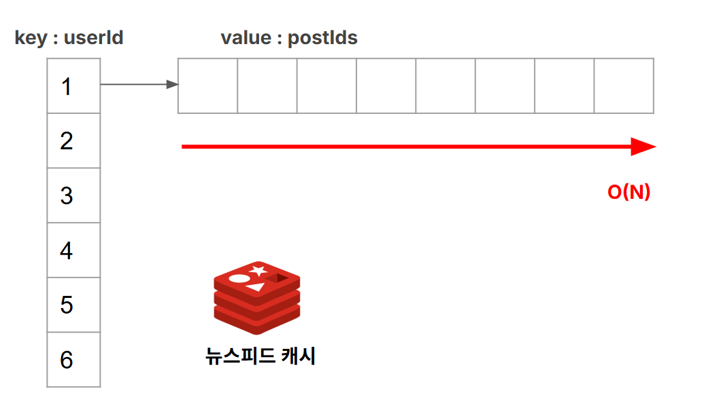

피드 조회 시간복잡도는 O(N)의 시간복잡도가 필요합니다.

일관된 피드 조회 성능을 제공하기 위해 Redis는 한명의 유저당 200개 까지의 게시물 저장하여 빠른 조회 성능을 보장합니다.

<!-- ## 메시지 유실 가능성 해결하기

## Redis가 비가용 상태가 되면 어떻게 해야할까?
RDBMS가 아닌 Redis에만 피드 데이터가 저장됩니다.

따라서 Redis가 비가용상태가 되었을 때, 서버 전체가 장애가 발생하게 됩니다.

하지만, RDBMS에 뉴스피드 테이블을 구성하는 것은 불가능하다고 판단하여 영속성을 제공할 방법이 필요했습니다.

[Mongo DB에다가 데이터 때려넣기]

[Mongo DB에서 부하 버티는 정도 확인해야함.]

## Redis가 죽고 난 이후 어떻게 데이터를 복구해야할까?
AOF기능 활용하기 -->

## RDBMS에 뉴스피드 테이블(집계 테이블)을 구성하면 안될까?
인스타그램의 팔로워수 1위는 호날두입니다. (인스타 공식 계정 제외)

호날두의 팔로워수는 무려 6억 5000만명에 달합니다.


</br>

**만약 MySQL에 집계 테이블을 구성한다면 호날두가 게시물을 작성했을 때 어떤 일이 발생할까요?**

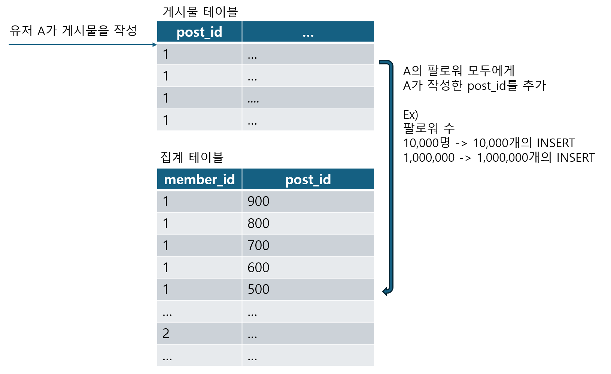
집계 테이블에 6.5억개의 INSERT요청이 필요합니다.

RDBMS는 기본적으로 쓰기 연산보다는 읽기 연산 최적화에 강점을 두고 설계되었습니다. 

이러한 RDBMS에서 게시물 생성시 수 많은 INSERT요청을 처리하는 것은 불가능하다고 판단했습니다.

## 인플루언서가 게시물을 작성하면 발생하는 문제
인스타그램의 팔로워수 1위는 호날두입니다.

호날두는 인스타그램에서 무려 6억 5천만명의 팔로워를 보유하고 있습니다. 


이런 인플루언서가 게시물을 작성하면 어떻게 될까요? 

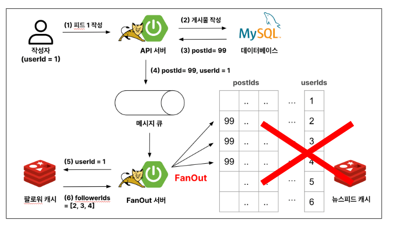

Redis에 수억개의 INSERT문은 Redis에 큰 부하를 야기할 수 있습니다.

Redis는 싱글 쓰레드로 동작하기에 다른 요청들이 해당 요청이 완료되기를 대기해야합니다.

위 문제를 해결하기 위해 인플루언서는 특별 취급하여 Redis에 Fan Out 시키지 않고 유저가 피드조회를 하는 시점에 게시물을 읽어오도록 설계했습니다.


인플루언서로 내부에서 따로 관리하여 유저가 팔로우하고있는 인플루언서가 작성한 게시물은 Redis,혹은 RDB에 따로 작성해두고 가져옵니다.

일반 유저의 게시물, 인플루언서의 게시물을 가져오는 API를 프론트가 각각 요청하여 프론트에서 시간 순으로 조합하게 됩니다.

## 게시물이 아니라 post_id만 캐싱한 이유
게시물 json데이터를 Redis에 캐싱했다면 읽기 요청이 훨씬 단순해지지 않을까?

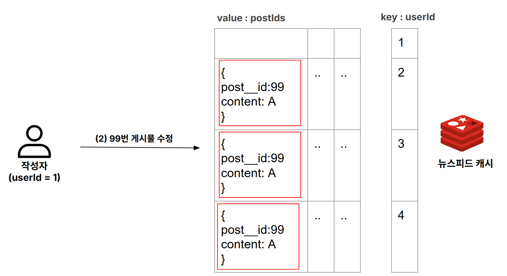

**99번 게시물의 content를 A->B로 수정하기 위해서 Redis전체를 탐색하여 99번 게시물을 모두 수정해야한다.**

Redis는 single thread 기반으로 동작하며 이러한 작업은 다른 요청들이 대기하게 되는 문제를 야기한다.

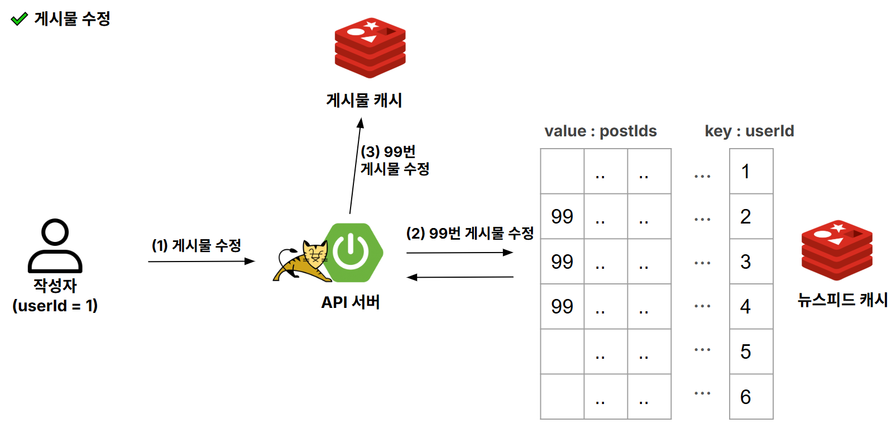

반면 post_id만 저장되어 있을 경우 게시물 캐시에 저장된 단일 데이터만 수정하면 된다.

## 팔로우 취소, 회원 탈퇴, 게시물 삭제의 경우 어떻게 해야할까?
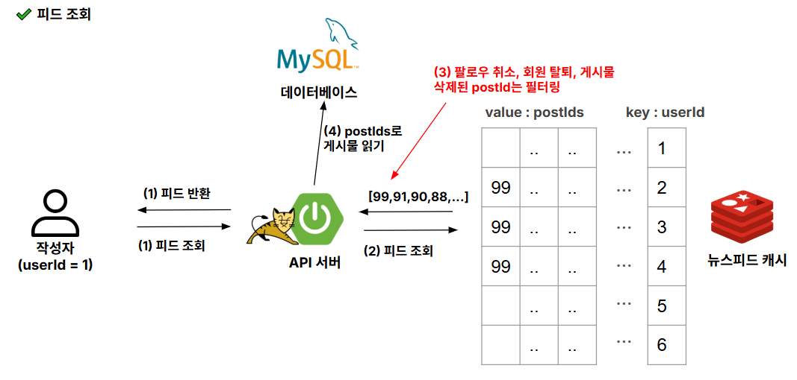

1. 유저가 회원 탈퇴를 하는 경우 유저를 팔로우 하고 있던 모든 유저의 피드를 탐색하여 게시물을 삭제해야합니다.
2. 게시물을 삭제할 경우 Redis 전체를 탐색하여 해당 게시물을 모두 삭제해야합니다.
3. 유저가 팔로우를 취소하더라도 기존 Redis를 탐색하여 데이터를 지우는 것은 O(N)의 시간복잡도가 걸립니다.
(팔로우 취소의 경우 유저당 200개의 게시물만 저장할 수 있게 하여 큰 부하는 1,2번과 동일한 방법을 이용하였습니다.)

이러한 부하를 방지하기 위해 WAS단에서 필터링하는 방법을 선택했습니다.

# 2️⃣ 댓글 조회 쿼리 성능 최적화 (1s 118ms -> 108ms)
## 요구사항
- 아래 페이지에서 댓글을 조회할 수 있다.
- 페이지네이션은 Cursor Pagination (NO OFFSET) 방식을 사용했다.

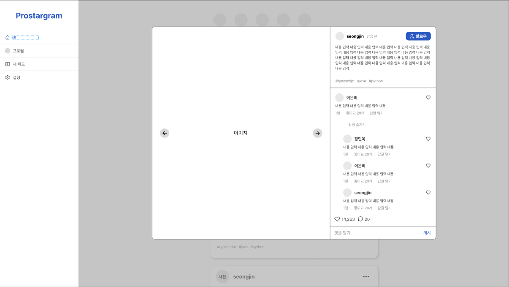

## 사용되는 쿼리문
```SQL
SELECT *
FROM COMMENT
WHERE comment_id < {lastCommentId} # NO OFFSET 방식
  AND post_id = {postId}
LIMIT 10 # PAGE_SIZE
```
## 댓글 조회 쿼리의 병목 지점 분석
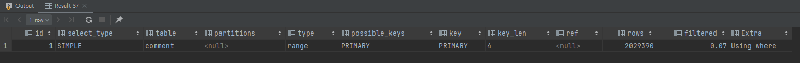

실행계획을 보면 PK를 활용해 INDEX RANGE SCAN이 이루어 지는 것을 볼 수 있습니다.

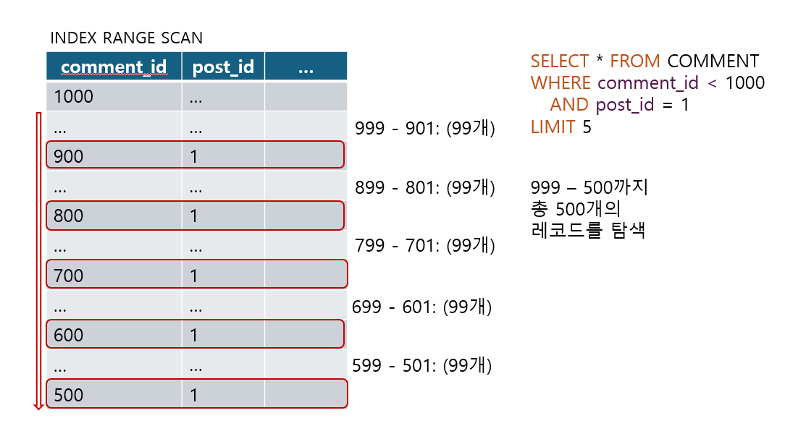

1. INDEX RANGE SCAN을 통해 인덱스를 탐색하면서 post_id가 1인 데이터만 필터링 필요합니다.

2. post_id가 1인 레코드 사이에 다른 데이터가 99개씩 삽입되어 있어 총 500개의 레코드를 탐색해야 합니다.

3. post_id가 1인 레코드 사이에 다른 데이터가 많을수록 읽어야 할 페이지 수가 증가하면서 성능이 급격히 감소함을 확인했습니다.

```
-> Filter: ((`comment`.post_id = 1) and (`comment`.comment_id < 1000001))  (cost=408818.99 rows=1352) (actual time=0.314..945.936 rows=10 loops=1)
    -> Index range scan on comment using PRIMARY over (1000001 < comment_id)  (cost=408818.99 rows=2029390) (actual time=0.031..883.398 rows=1000000 loops=1)
```

실제 실행계획을 확인해보면 1000만개의 row를 스캔하여 filtering하는 것을 확인할 수 있었습니다.

## 인덱스 수정하기
(post_id, comment_id) INDEX를 생성했습니다.

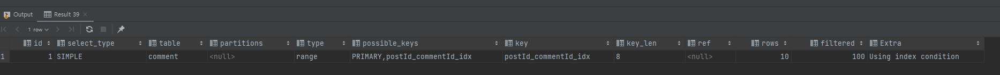

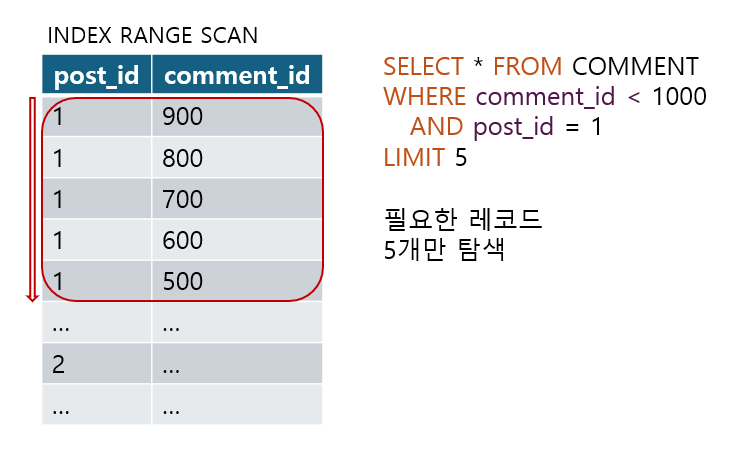

```
-> Index range scan on comment using postId_commentId_idx over (post_id = 1 AND 1000001 < comment_id), with index condition: ((`comment`.post_id = 1) and (`comment`.comment_id < 1000001))  (cost=12.24 rows=10) (actual time=0.030..0.129 rows=10 loops=1)

```

위 INDEX를 이용할 경우 같은 INDEX RANGE SCAN 이지만, 반드시 필요한 데이터들만 탐색해서 반환하게 됩니다.

## 성능 측정
적절한 인덱스 수정을 통한 쿼리 튜닝 **(1s 118ms -> 108ms)**

실행 쿼리: Cursor Pagination을 통해 한 페이지당 10개의 데이터를 가져오는 쿼리

더미 데이터: 
post_id가 1인 레코드사이 10만개의 다른 레코드 삽입 했습니다.

Clustering INDEX를 활용할 때, 총 100만개의 데이터를 탐색해야 하도록 더미데이터를 구성했습니다.

테스트 환경: i5-10400(6 core), 16GB RAM

## 📝 Server Architecture


## 🧾 [ERD(Entity Relationship Diagram)](https://www.erdcloud.com/d/RCprTk7yCrjyE7kWq)


## 🖼️ [Prototype](https://www.figma.com/design/5sskEbduPRM483B86tabRy/Prostagram?node-id=330-190&t=afdzsi5ib1yal9Fo-1)


